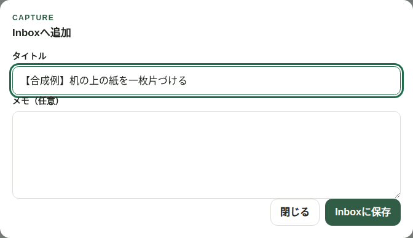
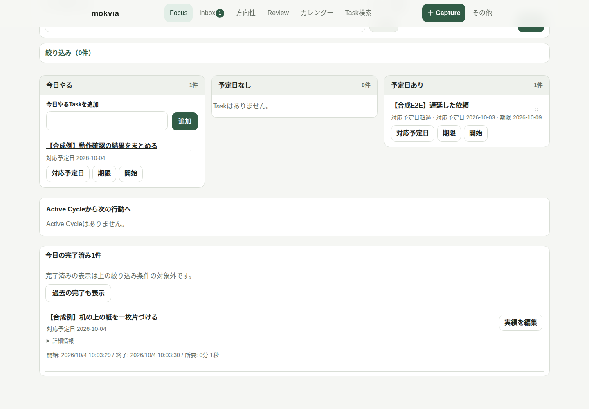

# はじめてのmokvia

**頭の中の「やること」を出して、今日進める一つを選ぶ。** mokviaは、一人分の仕事や気がかりを集め、整理し、進めた記録を残すタスク管理アプリです。依頼がいろいろな場所に来る方、次に何をするか迷う方、予定と作業実績を分けて見たい方に向いています。

最初のゴールは、**自分で作ったTaskを一つ、今日の作業として完了すること**。手入力だけで始められます。Outlook・Teams連携、AI、Projectの設定は最初の体験に必要ありません。

## まず、画面の見方をつかむ


*上はUbuntu上で会社配布版を動かした合成sampleの実画面。会社Windows／PAの実機動作は導入時の確認対象です。*

| 入口 | 使うとき |
| --- | --- |
| ＋ Capture → Inbox | 気になることや依頼を、とりあえずメモする |
| Focus → 今日やる | 今日進めるTaskを選び、開始・完了する |
| カレンダー | 対応予定日・予定・作業実績・期限を確認する |


**次へ：** Windowsでアプリを開き、練習用Taskを一つ作ります。

<!-- pagebreak -->

## 1. アプリを開く

著作権者の個別利用許可と会社の利用許可がある本人向けです。会社が許可したDocker（Linux containers／Compose v2）・PowerShell 5.1以上があるWindowsで、指定版ZIPを新しいフォルダーに展開します。まだ環境が整っていなければ、[図付きの導入手順](SETUP-WINDOWS.md) の「必要なもの」「最初の起動」を先に使ってください。

ZIP展開フォルダーをPowerShellで開き、実行します。

```powershell
.\windows\Start.ps1
```

ブラウザで **http://localhost:24873** を開きます。初回は空のデータです。すでに起動済みなら、このURLを開くだけで次へ進めます。

**成功チェック：** 上部に「Focus」「Inbox」などの入口が見えればOK。起動できないときは、[マニュアルの症状別FAQ](USER-MANUAL.md#faq) へ。

## 2. 最初のTaskをInboxへ入れる

1. 「＋ Capture」を開きます。
2. タイトルに **【合成例】机の上の紙を一枚片づける** と入力します。メモは空で構いません。
3. 「Inboxに保存」を押します。入力した内容がそのまま保存されます。
4. Inboxを開き、Task名が一つ増えたことを確認します。



*最初は短いタイトルだけで十分です。細かな分類や締切は後から決められます。*

**成功チェック：** 入力したTask名がInboxに残っている。何も増えない場合はエラー表示を確認し、保存結果が不明なまま何度も押さず、一度再読み込みします。

<!-- pagebreak -->

## 3. 今日の一つにして、開始する

1. InboxのTask名を開き、「次にやる」を選びます。
2. 「日付・時刻」を開き、「対応予定日」を今日にします。これは**取り組む日**です。本当の締切がなければ「期限」は空で構いません。
3. 入力内容を見て「確認して保存」を押します。
4. Focusへ戻り、「今日やる」にあるTaskの「開始」を押します。実行中のTaskになったことを確認します。

## 4. 実際に一枚片づけて、「完了」を押す

作業を終えたら、Focusの実行中Taskで「完了」を選びます。「今日の完了済み」を開き、同じTask名が残ったことを確認します。



**成功チェック：** 実行中からTaskが消え、完了済みに残る。これで最初の一巡は完了です。

## 次からは、この三つだけ

- 思いついたら **Capture**。その場で全部整理しなくて構いません。
- 作業前に **Inboxで次の行動を決め、Focusで今日の一つを選ぶ**。
- 作業後は **完了**。途中なら中断し、あとで続けます。

カレンダーを見たい、待ちTaskを使いたい、Outlook・Teamsを取り込みたいときは [USER-MANUAL.md](USER-MANUAL.md) の必要な章だけ読みます。終了は `.\windows\Stop.ps1`、次の起動はStartです。停止しても記録は保持されます。

**詰まったら：** Taskが見えないときはInbox／Focusの絞り込みと「今日の完了済み」を確認。起動・通知・保存の問題はマニュアルのFAQへ。会社環境の制限を変更して解決する手順ではありません。

利用は [LICENSE](../LICENSE) の個別許可と会社の利用規則に従います。記録は会社PC内に保存し、会社データを個人環境へ送信しません。
