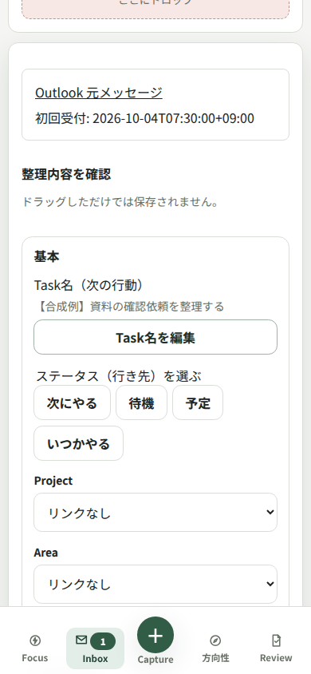
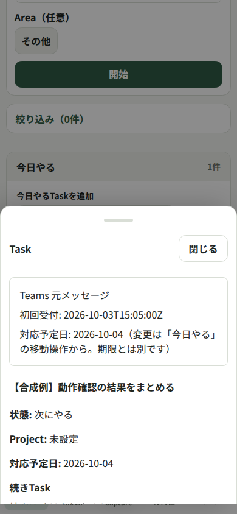

# 会社Windowsでmokviaを使う

会社PCでZIPを展開し、Docker上のmokviaを起動します。最初は手入力のTaskとローカルCalendarだけで試し、その後、必要なら会社OneDriveとPower Automate（PA）を使ってOutlook・Teamsから取り込みます。ブラウザの入口は **http://localhost:24873** です。

このガイドの画面は **Ubuntu上で会社配布版を起動した合成データの実画面** です。Windows・Docker Desktop・OneDrive・会社PAテナントの実機動作は未検証です。最後の受入確認を会社PCで行ってから実データを扱います。

## 1. 全体像と保存場所を確認する


取り込みを使わなければ、OneDrive・PAの設定は不要です。Google Calendar同期、Slack、外部ホスティング、自宅接続、GitHubへのデータバックアップは会社版で使いません。

| 保存するもの | 保存先 |
| --- | --- |
| 配布コード | 会社が許可したZIP展開フォルダー |
| Task・予定・作業実績・取り込み履歴 | 会社PC内のDocker named volume `mokvia_data`（コンテナ内 `/data`） |
| 起動設定・通知補助の状態 | `%LOCALAPPDATA%\mokvia`。ZIP展開先の外 |
| 任意のメッセージ受け渡し・PA受理台帳 | 会社OneDriveの専用フォルダー |
| バックアップ | 会社承認済みのローカル保存先。ソース・OneDrive等の同期先の外 |

共通化するのはcaptureとCalendarのコードです。会社Task・JSON・台帳・ログ・バックアップを私用Ubuntuや個人OneDriveへ送る手順ではありません。

## 2. 必要なものをそろえる

- 会社が許可したDocker。**Linux containers、Compose v2** が必要です。製品の契約・利用条件、イメージ取得の許可は会社で確認します。
- 指定版のmokvia ZIPを取得・展開する許可。取得元は https://github.com/kiyugithkvjl1024/mokvia です。
- 通常のログイン済みWindowsセッションと **Windows PowerShell 5.1以上**。
- 会社ポリシーに従ったPowerShell実行。実行制限・署名要求の緩和や迂回は行いません。
- 取り込みを使う場合だけ、会社OneDriveのローカル同期と会社PAのコネクター利用許可。

Node.jsの直接導入、Gitログイン・clone・pushは不要です。VS Codeの承認済みCopilotは任意の導入支援に使えます。会社が許可した入力範囲を守り、公開Issueや個人環境へ情報を搬出しません。実行・改変は [LICENSE](../LICENSE) に従う著作権者または個別許可済みの利用者が行います。

## 3. ZIPを展開し、最初の起動をする

1. 公開commitまたはreleaseを固定してZIPを取得します。ZIPを会社承認済みの**新しいソース用フォルダー**へ展開します。Taskやバックアップをここへコピーしません。
2. Dockerを会社の承認済み手順で起動し、Linux containersが使える状態にします。
3. PowerShellでZIP展開フォルダーを開き、次を実行します。スクリプトが会社ポリシーで拒否された場合は、制限を変更せず会社の承認された導入経路を確認します。

   ```powershell
   .\windows\Start.ps1
   ```

4. 初回のイメージ構築と起動を待ちます。StartはDocker・既存データ・ポートを確認し、`mokvia_data` を作成して起動します。既存Taskは初期化で上書きしません。
5. ブラウザが開いたら **http://localhost:24873** を確認します。自動で開かない場合も同じURLを使います。通知を利用する場合は「ブラウザ通知を許可」を選びます。

Startは固定Compose project `mokvia` とvolumeを再利用します。同時に別の配布コピーを起動しません。24873番ポートが他のプロセスに使われていれば停止せずエラーになります。

旧名の `gtd-local_gtd_data` 等のvolumeや `%LOCALAPPDATA%\GtdLocal` が見つかった場合、保存先を示して停止します。削除・自動移行・新しい空volumeの起動は行いません。検出した保存先を保全して確認します。Ubuntuの私用データを会社PCへ持ち込む導入手順ではありません。

## 4. 合成TaskとCalendarで操作を試す

初回の空データ環境では、まず架空Taskを手入力し、Inboxで整理します。運用中のデータへ導入する場合は先にバックアップし、合成サンプルを混在させません。

上部「カレンダー」から、または **http://localhost:24873/calendar** を開きます。日本時間の日・週・月を選び、対応予定日、時刻／終日の予定、作業実績、本当の締切を区別して確認できます。Taskの詳細・予定変更は既存のTask操作を通ります。


*Ubuntu上の会社sample実画面。架空Taskを表示しています。Windows画面の実機証拠ではありません。*

- **対応予定日**は取り組む日、**期限**は本当の締切です。
- **予定**と**作業実績**は別の情報です。Calendarの表示を切り替えても記録を書き換えません。
- ローカルCalendarはUbuntu本体と共通のコードですが、Google同期とは別表示です。この画面で新しいGoogle取得を開始せず、会社版へGoogle同期を導入しません。

## 5. 任意：会社OneDriveの取り込みを有効にする

手入力だけで使う場合は次の段階へ進みます。取り込みの既定値は無効です。

1. 会社OneDriveに `Mokvia\Incoming` のような専用フォルダーを作ります。エクスプローラーで「このデバイス上で常に保持する」を設定し、同期完了を確認します。
2. 会社PCの**既存ローカル絶対パス**を確認します。ソース展開先と重なる場所、ドライブroot、UNC共有、ネットワークドライブ、symlink／junctionは使いません。
3. ZIP展開先で次を実行します。`example`／`Example` は実際の会社PCの値へ置き換えます。

   ```powershell
   .\windows\Start.ps1 -CaptureFolder 'C:\Users\example\OneDrive - Example\Mokvia\Incoming'
   ```

4. `%LOCALAPPDATA%\mokvia\capture-config.json` に設定が保存されます。次回のStartとZIP更新後も同じ設定を再利用します。入力は `/capture-inbox` へ**読み取り専用**で渡され、ホストフォルダーの自動作成は行いません。
5. 初回の空データsample環境だけで、[Power Automateガイド](POWER-AUTOMATE-CAPTURE.md) の最短試験を行います。schemaやカードJSONをIncomingへ入れず、UUID名の合成例だけを使用します。

無効化は次の操作です。保存済み設定がある環境では、単にCaptureFolderを省略しても無効化されません。

```powershell
.\windows\Start.ps1 -DisableCapture
```

OneDriveのcloud reparse pointだけは許可します。標準Win32照会のAdd-Typeが会社ポリシーで禁止される場合は安全側に停止します。ポリシーを迂回しません。

## 6. 任意：Outlook・TeamsのPAフローを設定する

[POWER-AUTOMATE-CAPTURE.md](POWER-AUTOMATE-CAPTURE.md) の手順で会社内にフローを作ります。フローZIPのインポートではなく、再現用設定を会社テナントで確認する手順です。

| 入力元 | 利用者が行う操作 | 保存先 |
| --- | --- | --- |
| Outlook | メールに `mokvia Inbox` ／ `mokvia 今日` カテゴリを付ける | Inbox、または今日 |
| Teams | メッセージのメニューでフローを選び、フォームを入力する | Inbox、または今日 |

PAは初回受理のUUIDと日時を会社OneDriveの台帳へ保存・読戻ししてから、IncomingへJSONを渡します。同じソースの再送やカテゴリ変更でTaskを増やしません。今日の対応予定日は**最初の受理日の日本時間**で固定し、遅延到着しても取り込み日に移し替えません。

<table><tr><td></td><td></td></tr></table>

*Ubuntu上の会社sample実画面をモバイル幅で表示。左はOutlook合成例のInbox整理、右はTeams合成例のTask詳細です。TeamsアプリやWindows／PAの実画面ではありません。*

Inboxや今日のTask名から元メッセージリンクを確認し、対応予定日・状態・期限を通常のTask操作で変更できます。PA側のJSONを書き換えてTaskを移動させる手順ではありません。

## 7. 日常の起動・停止・通知

いつものZIP展開フォルダーで実行します。

```powershell
.\windows\Start.ps1
.\windows\Stop.ps1
```

Stopはmokviaの通知補助とサービスだけを停止し、volumeを保持します。他のプロセスを終了しません。手渡し元OneDriveが一時的に利用できなくても、Stop・状態確認・専用バックアップ／復元はcapture mountなしで実行できます。取り込みを有効にした通常起動は、指定folderの存在と安全性を確認してから行います。

Windows通知補助は10秒ごとにlocalhostを確認し、同一ユーザーのmutexで重複を防ぎます。補助が動いていればタブを閉じても監視します。補助のheartbeatが途絶えた場合は、開いているブラウザへ切り替わるためタブを開いたままにします。第三者PowerShellモジュールは不要です。

スリープ・電源断・ログアウト・停止中は通知できません。復帰時は現在の状態を読み直し、過去の通知を連続表示しません。集中モードや会社ポリシーが通知表示を抑える場合はUIで確認します。通知センターへの保存・表示成功は保証しません。

## 8. バックアップしてから更新する

バックアップは停止したデータのスナップショットです。既定は `%LOCALAPPDATA%\mokvia\Backups`。会社が許可したローカル保存先を使い、ソース内やOneDrive等の同期先を選びません。平文tarには会社データが含まれます。

```powershell
.\windows\Backup.ps1
.\windows\Backup.ps1 -Destination 'D:\ApprovedLocalData\mokvia-backups'
```

アプリを停止し、専用一時コンテナで検証したアーカイブを作り、`docker cp` で取得します。PowerShellのバイナリ標準出力リダイレクトは使いません。取得後も停止したままなので、必要ならStartします。Taskと `.local-state/capture-receipts` は一緒に保存します。PA側の受理台帳は会社OneDriveで別途保持します。

更新は [UPDATE-WINDOWS.md](UPDATE-WINDOWS.md) に従います。

1. 旧版フォルダーでBackupを実行し、取得完了を確認する。
2. 指定版ZIPを**別フォルダー**へ展開する。データや旧設定をソースへコピーしない。
3. 新版フォルダーでStartする。同じproject・volume・外部capture設定を再利用する。
4. 件数・代表Task・Calendar・通知・取り込み状態を読み戻し、旧版とバックアップを受入完了まで保持する。

復元は現データをソース外へバックアップしてから、停止中volumeへ行います。復元後も停止したままです。Start後に件数・代表記録・予定・実績を確認します。

```powershell
.\windows\Restore.ps1 -Archive 'D:\ApprovedLocalData\mokvia-backups\mokvia-example.tar' -BackupDirectory 'D:\ApprovedLocalData\mokvia-backups'
```

volume削除、Docker reset、`docker compose down -v` は更新・障害復旧に使いません。定期Backupは既定では登録しません。会社が許可する場合だけWindowsタスクスケジューラで承認済み操作を設定し、取得後もアプリが停止することを考慮します。

## 9. 困ったときに確認する

| 状況 | 確認すること |
| --- | --- |
| Startが拒否される | DockerのLinux containers、PowerShell会社ポリシー、旧名データ検出のエラーを確認。制限緩和・旧データ削除をしない |
| 24873番ポートが使用中 | 別の配布コピーや他アプリを確認。Startは他プロセスを停止しない |
| ブラウザが開かない | `http://localhost:24873` を開く。別PC／LANのアドレスは使わない |
| capture folderが無い／未同期 | 会社OneDriveのローカル同期、常時保持、保存済みパスを確認。新しいUUIDによる再投入はしない |
| Taskが取り込まれない | Inbox／Focus／Statusの取り込み状態で理由を確認。PA台帳と最終JSONの読戻しを照合 |
| 通知が見えない | ブラウザ許可、補助heartbeat、Windows集中モードを確認。UIの状態も確認 |
| JSON衝突／結果不明 | 当該入力を保留し、Task・receipt・recovery状態を会社内で照合。receipt削除や上書きで回避しない |

ZIP展開先で状態とログを確認できます。

```powershell
docker compose -p mokvia ps
docker compose -p mokvia logs --tail 80 app
```

ログ・エラーには会社情報が含まれ得ます。公開Issueや個人環境へ貼らず、会社内で必要な範囲に絞って確認します。

## 10. 会社PCで受入確認する

- [ ] Startを2回実行してもコンテナ・通知が重複しない。ポート競合時に他プロセスを停止しない。
- [ ] `docker compose -p mokvia port app 24873` が127.0.0.1限定で、別PCから到達しない。
- [ ] 合成Taskを作成・変更して再起動後に残る。Calendarの日・週・月とJST日付境界、予定／実績／締切が正しい。
- [ ] 作業開始・中断・完了、休憩期限、着手条件解放、レビューを操作できる。
- [ ] Windows通知とスリープ復帰を確認。通知補助の停止信号 `%LOCALAPPDATA%\mokvia\notify-stop` を使うと、heartbeat失効後に開いたブラウザへ切り替わる。Stop.ps1はアプリ全体を停止するため、この試験には使わない。
- [ ] Backup→隔離した合成記録の変更→Restore→読戻しで、Task・予定・実績・receiptを復元できる。バックアップがソース・同期先の外にある。
- [ ] 取り込みを使う場合、[PAガイドの受入確認](POWER-AUTOMATE-CAPTURE.md) を満たす。OneDriveが利用不能でも停止・バックアップ可能で、通常起動は安全側に止まる。
- [ ] 会社実データ、秘密、バックアップがソース・Git・公開Issue・個人環境へ混入しない。

実機受入で解消する対象はWindows通知、Docker Desktop、同期属性とAdd-Typeの会社ポリシー、PAコネクター権限・カテゴリfilter・Teams表示です。Ubuntuのsample画面で確認済みの範囲と区別して記録します。
