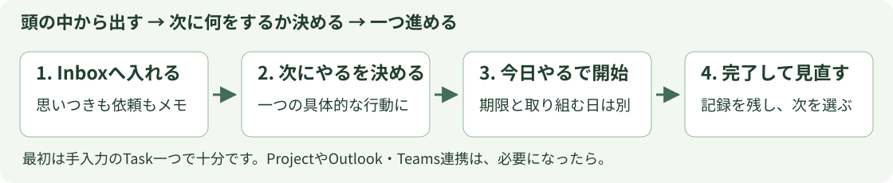
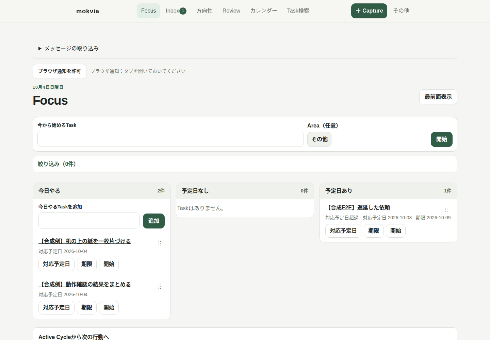
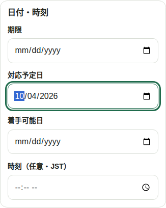
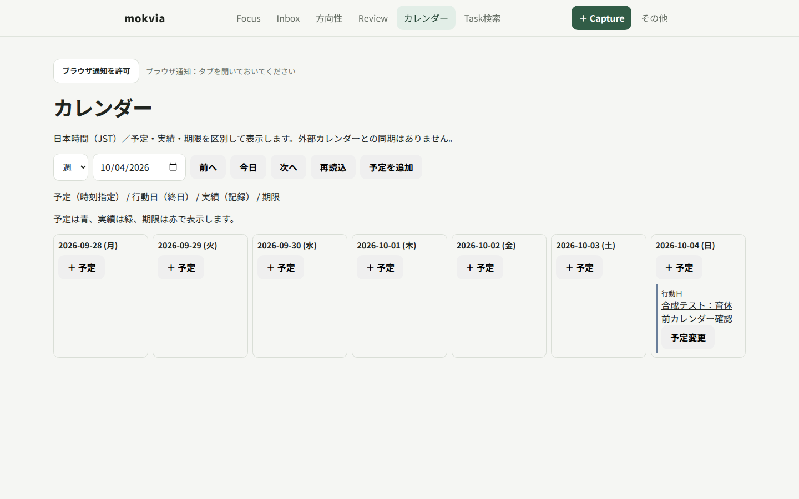
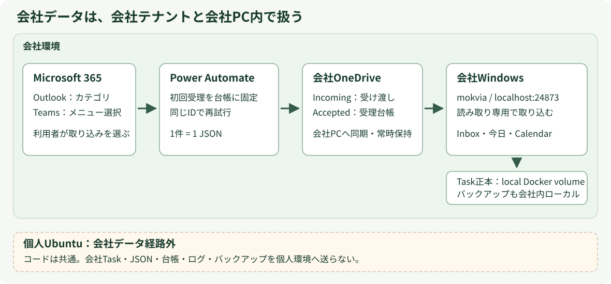

# mokvia 利用マニュアル

**集める、次の行動を決める、一つ進める、見直す。** mokviaは、一人分のTaskを会社PCのブラウザで扱うアプリです。依頼・思いつきをInboxへ集め、Focusで今日の作業を選び、予定と実績をCalendarで確認できます。操作の記録はローカルに残ります。

まだ一度も使っていなければ、まず3ページの [はじめてのmokvia](QUICKSTART.md) で「手入力Task→今日→完了」を体験してください。この冊子は、必要な章だけ読むための手引きです。

## この冊子の使い方

| やりたいこと | 読む章 |
| --- | --- |
| GTDの用語と全体の流れを知りたい | [1. 最低限の考え方](#basics) |
| 毎日の使い方を決めたい | [2. 日常の一巡](#daily) |
| Inbox・次にやる・今日やるを使い分けたい | [3. Taskを整理する](#organize) |
| 日・週・月で予定と実績を見たい | [4. ローカルCalendar](#calendar) |
| Taskを直す／中断／検索／保管したい | [5. 詳細操作](#details) |
| ProjectやReviewを使いたい | [6. 必要になったら広げる](#extend) |
| Outlook・Teamsを取り込みたい | [7. 任意のメッセージ連携](#messages) |
| 停止・更新・バックアップしたい | [8. 保存と更新](#backup) |
| 動かない／見つからない／保存が不明 | [9. 症状別FAQ](#faq) |
| 会社とライセンスの許可を確認したい | [10. 利用条件と次の案内](#permission) |



この冊子の画面は、Ubuntu上で会社配布版を動かした**全合成sampleの実画面**です。会社Windows・Docker Desktop・OneDrive・PAテナントの実機動作は未検証で、[導入ガイド](SETUP-WINDOWS.md) の受入確認を使用します。最初の手入力利用にM365・AI・外部同期の設定は不要です。

<!-- pagebreak -->

<a id="basics"></a>

## 1. 最低限の考え方

GTDは、気がかりを頭の外へ出し、次にする行動を決め、見直しながら進める考え方です。全用語を覚えてから始める必要はありません。

| 用語 | mokviaでの意味 | 例 |
| --- | --- | --- |
| Task | 一つの行動・気がかりの記録 | 「見積書の金額を確認する」 |
| Inbox | まだ整理していないTaskの置き場 | 「見積書の件」だけでも収集できる |
| 次にやる（Next） | 行動が明確で、取り組む候補 | 「担当者に確認事項を送る」 |
| 今日やる（Today） | 対応予定日（予定Taskは予定開始日）が今日のTask | 今日進める候補。状態名ではない |
| Project | 複数の行動が必要な成果 | 「提案資料を完成させる」 |
| Review | 残りTaskと状況を見直す時間 | 今日のInboxを整理する |

**よいTask名は、次の動作が見える名前です。** 「資料」より「資料の見出しを三つ書く」。収集時は曖昧でも、取り組む前に言い換えれば構いません。

### 三つの違いを覚える

- **対応予定日**：自分が取り組む日。今日への移動に使います。
- **期限**：本当に守る必要がある締切。今日やりたいだけでは設定しません。
- **予定**：時刻や終日で確保する枠。実際に作業した時間とは別です。

毎回Project・Area・見積時間を埋める必要はありません。まずTask名と行き先を決めます。重要度の点数を付けるより、今の状況・使える時間・日付・期限を見て一つ選びます。

**できたら次へ：** 今のInboxから、具体的な行動にできるTaskを一つ選びます。思いつかない場合は、「何を見れば判断できるか」を次の行動にします。

<!-- pagebreak -->

<a id="daily"></a>

## 2. 日常の一巡

### 作業前

1. ZIP展開フォルダーで `.\windows\Start.ps1` を実行します。すでに起動済みなら **http://localhost:24873** を開きます。
2. Inboxに残る気がかりを見ます。すぐ取り組むものの名前を具体化し、「次にやる」へ保存します。
3. Focusの「今日やる」を見て、今日進めるTaskだけを選びます。数を埋める必要はありません。



### 作業中・作業後

- 一つのTaskで「開始」。実行中のTaskと経過時間を確認します。
- 途中で止めるなら「中断」。表示された続きの扱いを確認して保存します。
- 終わったら「完了」。今日の完了済みで記録を確認します。
- 新しい依頼は「＋ Capture」でInboxへ。その場で取り組む必要はありません。

一日の終わりに、Inboxと未完了Taskを短く見直します。必要ならReviewを記録します。止めるときは `.\windows\Stop.ps1`。データを消す操作ではありません。

**成功チェック：** 実行中が今している作業と一致し、終えたTaskが完了済みに残る。予定変更は日付を直し、実績を架空の予定で埋めません。

<!-- pagebreak -->

<a id="organize"></a>

## 3. Taskを整理する

### Inbox → 次にやる → 今日やる

1. 「＋ Capture」でタイトルと任意のメモを保存します。TaskはInboxに入ります。
2. InboxでTask名を開きます。行き先を選び、必要なら名前を「次の動作」が分かる形へ直します。
3. 「次にやる」を選びます。今日取り組むなら「日付・時刻」を開き、「対応予定日」を今日にします。
4. 入力内容を見て「確認して保存」を選び、Focusで行き先を読み戻します。



*Inboxの「日付・時刻」。対応予定日と、本当の期限は別の入力欄です。*

### 行き先で迷ったら

| 行き先 | 選ぶ目安 |
| --- | --- |
| 次にやる | 次の行動が決まり、実行候補になった |
| 待機 | 返信や着手可能日などを待つ。待っている対象／日付を記録する |
| 予定 | 時刻または日を確保して実行する。予定日時を入力する |
| いつかやる | 今は取り組むと決めていない |
| アーカイブ | 日常の一覧から保管へ移したい |

Focusでは「対応予定日」から「今日やる」「予定日あり」「予定日なし」へ移動できます。今日やるはNext／予定Taskの日付による表示区分で、別の保存状態ではありません。過去の対応予定日のTaskは「予定日あり」に「対応予定日超過」として残ります。今日やるへ自動で移したり、日付を今日へ変更したりしません。

**詰まったら：** 取り組めない理由が返信待ちなら「待機」、まだ行動が決まらないならInboxで整理を続けます。期限があるだけで「今日やる」に決まるわけではありません。

<!-- pagebreak -->

<a id="calendar"></a>

## 4. ローカルCalendar

上部「カレンダー」、または **http://localhost:24873/calendar** を開きます。日本時間（JST）の日・週・月を選び、前へ／今日／次へで表示範囲を動かします。



| 表示 | 意味 |
| --- | --- |
| 対応予定日（行動日） | 取り組む日。時刻枠や期限とは別 |
| 予定 | 時刻指定／終日の予定。予定変更はTask操作で保存 |
| 実績 | 開始・終了から記録された作業時間 |
| 期限 | 明示された締切 |

「予定を追加」や各日の「＋予定」から入力し、既存の確認・保存操作を通します。既存TaskはTask名／「予定変更」から確認・編集します。画面の移動や再読込だけでTaskを書き換えません。

Google Calendarとの同期画面ではありません。本体と同じローカルCalendarのコードを使いますが、既存Google同期とは別表示で、新しいGoogle取得を開始しません。会社版へGoogle同期を導入する手順もありません。

**成功チェック：** 予定と実績が区別され、対応予定日と期限が意図した日付にある。日付がずれたときはJSTと入力値を確認し、予定に合わせるために実績を変更しません。

<!-- pagebreak -->

<a id="details"></a>

## 5. 詳細操作

### 名前・メモ・日付を直す

Task名を開き、画面の編集操作から変更します。タイトルは具体的な行動、メモは必要な補足にします。対応予定日と期限は別々に選びます。通常の編集・開始・完了はボタン操作で保存されます。保存後に一覧・詳細を読み戻します。アーカイブは確認画面で内容を読み、「この内容でアーカイブ」を押します。

操作中に別画面へ移る前は、未保存の変更を保存するか取り消すか選びます。「保存しました」と確認できない変更を、記憶だけで保存済みと扱いません。

### 開始・中断・完了

| 操作 | 使うとき |
| --- | --- |
| 開始 | 実際に作業を始める。実行中の表示を確認する |
| 中断 | 作業を途中で止める。続きTaskの内容・記録を確認する |
| 完了 | Taskが終わった。完了済みへ移り、実績が残る |
| 別Taskへ切替 | 実行中Taskの扱いを選ぶ画面で「中断して切替」／「完了して切替」を確認する |

「開始できません」の場合は、依存Taskや着手可能日時など、画面の理由を確認します。取り組めないTaskを強制的に開始する手順ではありません。実績時刻の編集は、事実を直す場合に使い、未来の時刻は保存できません。

### 検索と保管

「Task検索」でタイトル・ID・本文を検索できます。完了も対象です。空白区切りの語はすべて含むTaskを探します。保管済みを探す場合は「保管済みも含める」を選びます。

アーカイブは日常の一覧からの保管です。完了した事実と保管は別です。重要な編集・保管の前には対象Task名を確認します。復元や削除など影響が大きい操作は、画面の対象・確認を読み、バックアップを確保してから行います。

### 入力欄の目安

Projectは成果との関連、Areaは責任範囲、Contextsは使える場所や道具、見積時間は作業量の目安です。必要なものだけ入力します。Projectを選ぶとAreaを引き継ぐ場合があります。AIが自動で正しい分類を決める前提ではありません。

**詰まったら：** 保存結果不明・競合・復旧待ちが出たら、連打や直接ファイル上書きで解決せず、9章のFAQを使います。

<!-- pagebreak -->

<a id="extend"></a>

## 6. 必要になったら広げる

### Project：複数のTaskがある成果をまとめる

「提案資料を完成させる」のように複数の行動が必要な成果はProjectとして扱えます。「方向性」からProjectを確認し、関連Taskや計画を整理します。Taskは一つの行動、Projectは達成したい成果です。

Project詳細ではメモ（Project Support）、計画ツリー、単独Taskを確認できます。計画内のTaskと、今すぐ実行する「次にやる」は区別します。最初から計画を全部作る必要はありません。今の次の一歩を決めてから広げます。

### Review：やることの一覧を信頼できる状態に戻す

| 頻度の目安 | 確認すること |
| --- | --- |
| 日々の見直し | Inbox、実行中、予定、今日の未完了。変更が必要ならTaskを直す |
| 週ごとの見直し | Inbox、Next、Waiting、Scheduled、Someday、Projectの次の一歩 |

Review画面の「詳しいやり方」は、実際の画面内ガイドを開く入口です。見直しを記録するだけでTaskを自動完了・変更するものではありません。

### Areaと方向性

継続して責任を持つ範囲はArea、長期の方向性はGoalなどとして扱えます。「方向性」で必要な範囲を見直します。最初のTask一つの体験には不要です。FocusのArea絞り込みを使った場合、Inboxは全件を確認する置き場です。

### Copilotを使いたい場合

会社承認済みCopilotは任意の導入・整理支援です。[COPILOT.md](COPILOT.md) の開始文と操作境界を使います。無人AI実行・APIキー・M365 Copilot・Copilot CLIは必須ではありません。会社が許可した情報だけを、許可されたサービス内で扱います。

**成功チェック：** Projectに達成したい成果があり、少なくとも次の一歩が分かる。入力欄を埋めること自体を目的にしません。

<!-- pagebreak -->

<a id="messages"></a>

## 7. 任意のメッセージ連携

手入力の利用ができてから、必要な場合だけ有効にします。会社M365のメッセージを会社PAで受理し、会社OneDriveから会社PCのmokviaへ渡します。会社データはこの経路の外へ送信しません。



| 入力元 | 自分が行う操作 |
| --- | --- |
| Outlook | `mokvia Inbox` ／ `mokvia 今日` カテゴリを付ける |
| Teams | メッセージのメニューからフローを選び、フォームへ入力する |

会社OneDriveの既存・専用ローカルfolderを指定します。設定は外部保存され、再起動・ZIP更新後も再利用します。

```powershell
.\windows\Start.ps1 -CaptureFolder 'C:\Users\example\OneDrive - Example\Mokvia\Incoming'
```

取り込みを無効にする場合は `.\windows\Start.ps1 -DisableCapture`。引数を省略するだけでは保存済み設定を無効化しません。

**同じメッセージの再送でTaskを増やしません。** 最初の受理UUID・日時・内容を台帳で保持します。今日へ受理したTaskは最初の受理日のJST対応予定日を使い、到着が遅れても取り込み日に移し替えません。元メッセージリンクはTaskから開けます。

詳細は [POWER-AUTOMATE-CAPTURE.md](POWER-AUTOMATE-CAPTURE.md) のOutlook／Teams設定・受理台帳・会社受入確認です。会社PAテナントの権限、カテゴリfilter、Teamsメニュー表示、OneDriveの同期属性は未検証で、会社で確認します。合成sampleを運用中のTaskへ混ぜません。

**次へ：** まず隔離した空のsample環境で一件・再送・再起動を試し、受入後に実データへ導入します。JSON・台帳を手で上書きしたりUUIDを変えたりしてTask更新の代わりにしません。

<!-- pagebreak -->

<a id="backup"></a>

## 8. 保存と更新

### どこに記録があるか

| 内容 | 保存先 |
| --- | --- |
| 配布コード | ZIP展開フォルダー |
| Task・予定・実績・取り込み履歴 | 会社PC内のDocker named volume `mokvia_data` |
| capture設定・通知補助の状態 | `%LOCALAPPDATA%\mokvia`（ZIPの外） |
| バックアップ | 承認済みローカル保存先（ソース・同期先の外） |
| PA受理台帳 | 会社OneDriveの専用台帳folder |

会社データをソースや公開Gitへ入れません。TaskのバックアップにPA台帳を代用せず、それぞれ会社内で保持します。

### 起動・停止・バックアップ

```powershell
.\windows\Start.ps1
.\windows\Stop.ps1
.\windows\Backup.ps1
```

Stopはmokviaだけを停止し、データvolumeを保持します。Backupはアプリを停止して平文tarを作り、**取得後も停止したまま**です。既定は `%LOCALAPPDATA%\mokvia\Backups`。必要なら承認済みローカル保存先を指定します。

```powershell
.\windows\Backup.ps1 -Destination 'D:\ApprovedLocalData\mokvia-backups'
```

Taskと取り込みreceiptは一緒にバックアップ・復元します。OneDriveが一時的に利用不能でもStop・状態確認・専用Backup／Restoreはcapture mountなしで行えます。有効化した通常起動はfolderの存在・安全性を確認します。

### 新版ZIPへの更新

1. 旧版でBackupし、取得完了を確認します。
2. 指定版ZIPを**別フォルダー**へ展開します。
3. 新版でStartします。同じvolume・外部capture設定を使います。
4. 代表Task、Calendar、通知、取り込み状態を読み戻します。

詳細は [UPDATE-WINDOWS.md](UPDATE-WINDOWS.md)。復元は現データの保全と停止中volumeでの確認が必要です。[SETUP-WINDOWS.md](SETUP-WINDOWS.md) のBackup／Restoreを使います。Docker resetやvolume削除、`docker compose down -v` を更新に使いません。

<!-- pagebreak -->

<a id="faq"></a>

## 9. 詰まったときのFAQ

| 症状・疑問 | まずすること／次の参照 |
| --- | --- |
| 最初にどこまで設定すればよい？ | Startで起動して、手入力Task一つを完了すれば十分。Project・M365・AI設定は後から。QUICKSTARTへ |
| 今使う版を確認したい | 指定されたZIPのダウンロードURLにあるcommit／releaseを確認。ZIP名と展開元URLを会社内で記録する。分からなければZIP名を控え、取得元の指定版を確認してから更新する |
| Startが実行できない | DockerのLinux containers／Compose、会社PowerShellポリシー、エラーの旧データ検出を確認。制限緩和や旧データ削除をしない。SETUP-WINDOWS 2〜3章へ |
| ブラウザが開かない | `http://localhost:24873` を開く。Dockerが起動しているか、ポート競合のエラーがないか確認。別PCのLANアドレスを使わない |
| Taskが見えない | Inbox、Focusの絞り込み、折りたたまれた「今日やる」「今日の完了済み」を確認。Task検索で名前を探す。保管した場合は保管済みも対象へ |
| 今日に置いたのに日付が変わらない | 過去日は「予定日あり」に「対応予定日超過」で表示される。保存日付は自動で書き換えない。「対応予定日」で意図した日へ移す |
| 期限と対応予定日のどちらを入れる？ | 取り組む日は対応予定日、約束された締切は期限。今日やりたいだけなら期限は不要 |
| 「開始できません」になる | 着手可能日時や依存など画面の理由を確認。無理に保存状態を書き換えて開始しない |
| 保存されたか分からない／競合が出る | 一度再読み込みし、対象Taskを確認。保存結果が不明な操作を連打しない。復旧待ちなら表示に従う。直接Markdownを上書きしない |
| 通知が出ない | ブラウザ通知許可、開いたタブ、通知補助heartbeat、Windows集中モードを確認。スリープ・停止中は通知できない。UIの状態も見る |
| Outlook・Teamsから来ない | 取り込み状態とPA実行履歴、台帳・最終JSONの読戻しを会社内で照合。受理結果不明の新UUID再送はしない。PAガイドへ |
| 更新したら空に見える | 旧版の同じvolumeとproject、保存場所を確認。新規Task投入やvolume削除をせず、Backup・旧版を保全してSETUP／UPDATEの手順へ |

状態・ログの確認はZIP展開先で次を使います。

```powershell
docker compose -p mokvia ps
docker compose -p mokvia logs --tail 80 app
```

**自分で解消できない場合：** 使っている版、試した操作、期待した表示、エラー表示、保存結果が確認できるかを会社内の承認された相談先へ伝えます。実Task本文・ログ・接続情報を公開Issueや個人環境に貼りません。データ削除や会社ポリシー変更を自己流の復旧にしません。

<!-- pagebreak -->

<a id="permission"></a>

## 10. 利用条件と次の案内

### 会社の許可と、本人の利用許可

会社がDocker・PowerShell・保存場所・Copilot等の利用を許可することと、著作権者がmokviaの実行・改変を個別に許可することは、それぞれ確認が必要です。この冊子は両方の許可がある本人向けです。ソース公開・ZIP取得だけで実行の許可になるわけではありません。

現行の自作コード・資料には [mokvia 個別許可利用条件](../LICENSE) が適用されます。許可された本人の個人利用と勤務先での本人の業務利用が対象です。他社員へ自動的に許可が広がることはありません。社内共用サーバー、他人向けサービス、再配布・販売・再許諾は別途許可が必要です。正式な条件はLICENSEと記録に残る個別の許可を確認します。過去MIT版・第三者の条件は維持されます。

### 情報を保持する範囲

Task正本とバックアップは会社PCの承認された場所、メッセージ連携は会社M365／会社OneDrive内です。個人Ubuntu・個人OneDrive・公開repoへ会社データを送信しません。Copilot利用も会社で許可されたサービス・入力範囲に限定します。

Ubuntu本体と会社配布はcapture／ローカルCalendarの汎用コードを共通化しています。会社データをUbuntu本体へ送って同期する仕組みではありません。

### 次に必要な資料だけ読む

| 資料 | 役割 |
| --- | --- |
| [QUICKSTART.md](QUICKSTART.md) | 最初の手入力Taskから今日・完了まで |
| [SETUP-WINDOWS.md](SETUP-WINDOWS.md) | 図付き導入、保存先、通知、実機受入確認 |
| [POWER-AUTOMATE-CAPTURE.md](POWER-AUTOMATE-CAPTURE.md) | 任意の会社Outlook／Teams連携 |
| [UPDATE-WINDOWS.md](UPDATE-WINDOWS.md) | 停止Backupから別フォルダー更新、読戻し |
| [COPILOT.md](COPILOT.md) | 会社承認済みCopilotへの手動支援の開始文 |

**この冊子の終了チェック：** 自分のTaskを収集し、行き先と対応予定日を決め、開始・完了の記録を確認できる。保存場所と停止・Backupの入口が分かり、困ったときに必要な章を開ける。ここまでできれば、最初の運用を自分で続けられます。

Outlookの会議予定をボタンで取り込み、終了した会議を完了・実績調整する追加機能は [OUTLOOK-CALENDAR.md](OUTLOOK-CALENDAR.md) を参照してください。メールのTask取り込みとは別機能です。会社接続・Windows Outlook実機は復帰後の受入対象です。
